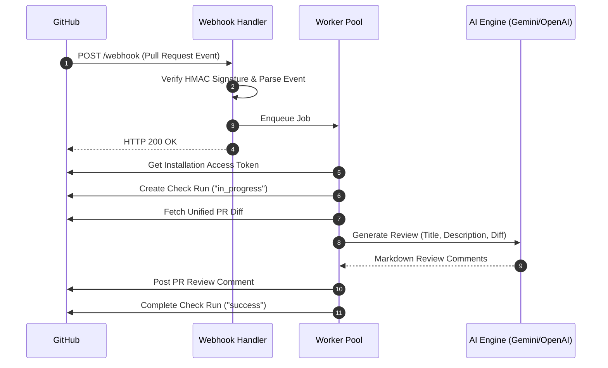

# 🤖 GitHub PR Review Bot

An automated, AI-powered GitHub App written in Go that automatically analyzes Pull Requests, reports real-time check statuses, and posts constructive code reviews.


---

## ✨ Features

- ⚡ **Asynchronous Worker Pool**: High-performance worker pool processes incoming pull requests asynchronously without blocking webhook HTTP handlers.
- 🎯 **GitHub Check Runs**: Creates real-time progress status indicators ("in_progress" ⏳ -> "completed" ✅) on PR check sections.
- 🤖 **AI-Powered Code Reviews**: Uses LLM provider APIs (e.g. Gemini, OpenAI) to generate structured code reviews analyzing PR titles, descriptions, and unified diffs.
- 🔒 **Secure GitHub App Auth**: Uses RS256 JWT signatures with GitHub App private keys to fetch short-lived installation access tokens.
- 🔄 **Event Handling**: Supports `opened`, `reopened`, and `synchronize` (new commit pushes) pull request events.
- 🐳 **Container Ready**: Includes lightweight multi-stage `Dockerfile` and `docker-compose.yml` out of the box.

---

## 🏗 Architecture & Flow



---

## 🚀 Quick Start

### Prerequisites

- [Go 1.24+](https://go.dev/dl/) or [Docker & Docker Compose](https://www.docker.com/)
- A registered **GitHub App** (see setup section below)
- An AI API key (e.g., Google Gemini or OpenAI API Key)

### Local Setup

1. **Clone the repository**:
   ```bash
   git clone https://github.com/Satvik01000/GitHub-PR-Review-Bot.git
   cd GitHub-PR-Review-Bot
   ```

2. **Configure environment settings**:
   Copy `config.example.toml` to `config.toml`:
   ```bash
   cp config.example.toml config.toml
   ```

3. **Add your GitHub App Private Key**:
   Place your downloaded `.pem` private key file in the root directory (or point to its path in `config.toml`).

4. **Run the server**:
   ```bash
   go run ./cmd/server
   ```
   The server will start listening on port `:8080`.

---

## 🐳 Running with Docker

### Using Docker Compose (Recommended)

```bash
# Build and run in detached mode
docker compose up -d --build

# View live logs
docker compose logs -f

# Stop the service
docker compose down
```

### Using Docker CLI

```bash
# Build Docker image
docker build -t github-pr-review-bot .

# Run container
docker run -d \
  -p 8080:8080 \
  -v $(pwd)/config.toml:/app/config.toml:ro \
  -v $(pwd)/private-key.pem:/app/private-key.pem:ro \
  --name pr-review-bot \
  github-pr-review-bot
```

---

## ⚙️ Configuration Reference (`config.toml`)

| Section | Parameter | Description |
| :--- | :--- | :--- |
| `[server]` | `port` | Server HTTP port (e.g. `":8080"`) |
| `[server]` | `webhook_secret` | GitHub Webhook secret for HMAC payload verification |
| `[github]` | `app_id` | Your GitHub App ID |
| `[github]` | `private_key_path` | Path to the downloaded GitHub App `.pem` private key |
| `[worker]` | `max_workers` | Maximum concurrent background workers |
| `[worker]` | `queue_size` | Capacity of the job queue buffer |
| `[ai]` | `provider` | AI service provider (`"gemini"`, `"openai"`) |
| `[ai]` | `api_key` | API key for the AI provider |
| `[ai]` | `base_url` | Base URL of the OpenAI-compatible REST API endpoint |
| `[ai]` | `model` | Target model name (e.g., `"gemini-3.6-flash"`) |
| `[ai]` | `timeout_seconds` | Request timeout in seconds for AI generation |

---

## 🔑 Setting Up Your GitHub App

1. Go to **GitHub Settings** > **Developer Settings** > **GitHub Apps** > **New GitHub App**.
2. Set **Webhook URL** to your server endpoint (e.g. `https://your-domain.com/webhook` or Smee.io proxy for local dev).
3. Set **Webhook Secret** matching `webhook_secret` in your `config.toml`.
4. Configure **Permissions**:
   - **Pull requests**: `Read & Write`
   - **Checks**: `Read & Write`
   - **Metadata**: `Read-only`
5. Subscribe to **Events**:
   - Check **Pull request**.
6. Generate and download a **Private Key** (`.pem`) and copy your **App ID**.
7. Install the GitHub App on your target repository or organization.

---

## 🧪 Development & Testing

Run Go unit tests:
```bash
go test -v ./...
```

Check code formatting:
```bash
gofmt -s -w .
```

---

## 📄 License

This project is open source and available under the [MIT License](LICENSE).
